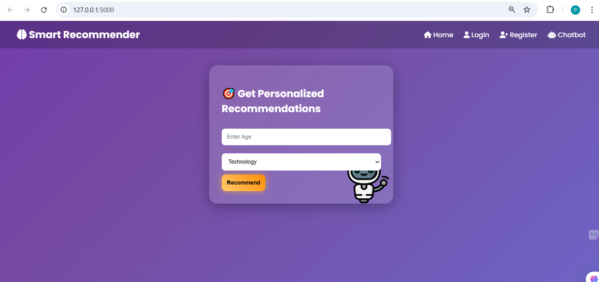
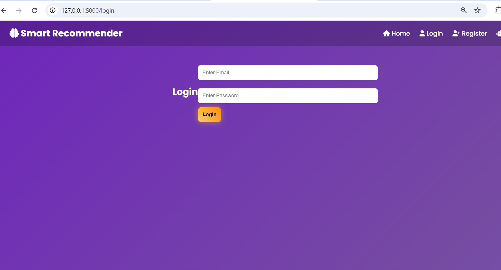
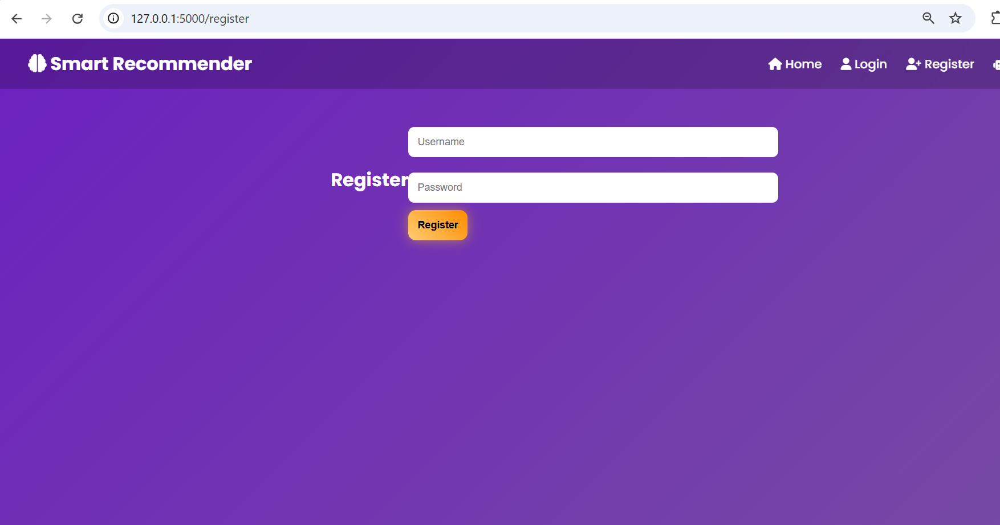
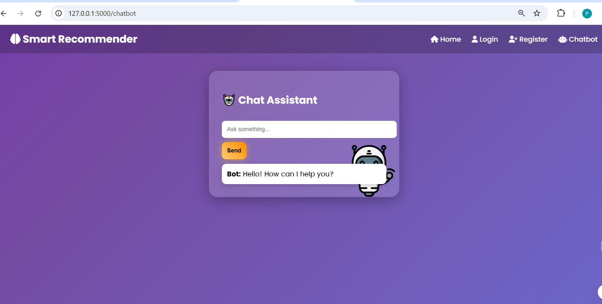

# 🚀 Rule-Based Recommendation System

A full-stack **Rule-Based Recommendation Web Application** built using **Python (Flask)**, **MongoDB**, **HTML**, **CSS**, and **JavaScript**.
The system provides personalized recommendations to users based on predefined rules, along with authentication, admin analytics, chatbot interaction, and history tracking.

This project demonstrates the practical implementation of **Artificial Intelligence concepts (rule-based systems)** combined with modern **web development** practices.

---

# 📌 Project Overview

In today’s digital world, recommendation systems are widely used in platforms such as e-commerce, education, healthcare, and entertainment.
This project implements a **rule-based recommendation engine** where decisions are generated based on logical conditions rather than machine learning models.

The application includes:

* User authentication system
* Admin rule management
* Recommendation generation
* Chatbot interface
* Analytics dashboard with charts
* Recommendation history tracking
* Secure password encryption
* Responsive professional UI

---

# 🎯 Objectives

* To design and implement a rule-based decision system
* To provide personalized recommendations based on user inputs
* To develop a complete full-stack web application
* To integrate database storage and analytics visualization
* To demonstrate secure authentication and role-based access

---

# 🏗️ System Architecture

```
User → Flask Routes → Recommendation Engine → Database → UI Response
                     ↓
                  Admin Panel
                     ↓
                 Analytics Charts
```

Main components:

* Frontend (HTML, CSS, JS)
* Backend (Flask)
* Database (MongoDB)
* Rule Engine (Python logic)
* Authentication System (bcrypt)
* Analytics Visualization (Chart.js)

---

# 🛠️ Technologies Used

## Backend

* Python
* Flask Framework
* PyMongo
* bcrypt

## Frontend

* HTML5
* CSS3
* JavaScript
* Chart.js

## Database

* MongoDB

## Tools

* Git & GitHub
* VS Code

---

# ✨ Features

## 👤 User Features

* User Registration & Login
* Secure Password Encryption
* Personalized Recommendations
* Recommendation History Tracking
* Chatbot Assistance
* Dashboard Interface
* Logout System

## 🔐 Admin Features

* Admin Login Protection
* Add / Manage Recommendation Rules
* Analytics Dashboard
* Charts Visualization
* User Data Monitoring

## 📊 Analytics

* Total Users Count
* Total Recommendations Count
* Category Distribution Charts
* Pie Chart Visualization

## 🤖 Chatbot

* Interactive chatbot interface
* Rule-based conversational recommendations

---

# 📂 Project Structure

```
rule-based-recommendation/
│
├── app.py
├── rules.py
├── requirements.txt
│
├── database/
│   └── db.py
│
├── routes/
│   ├── auth_routes.py
│   ├── user_routes.py
│   ├── admin_routes.py
│   └── chatbot_routes.py
│
├── templates/
│   ├── base.html
│   ├── index.html
│   ├── login.html
│   ├── register.html
│   ├── dashboard.html
│   ├── admin.html
│   └── chatbot.html
│
├── static/
│   ├── style.css
│   └── images/
│
├── screenshots/
│
└── README.md
```

---

# ⚙️ Installation Guide

## 1️⃣ Clone Repository

```
git clone https://github.com/Prabhanshiyadav/rule-based-recommendation-system.git
cd rule-based-recommendation-system
```

## 2️⃣ Install Dependencies

```
pip install -r requirements.txt
```

## 3️⃣ Setup MongoDB

Make sure MongoDB is running locally.

```
mongodb://localhost:27017/
```

Database name:

```
recommendation_db
```

Collections:

* users
* rules
* history

---

# ▶️ Run Project

```
python app.py
```

Open browser:

```
http://127.0.0.1:5000
```

---

# 🔑 Admin Login Setup

Create admin user manually in MongoDB:

Email: [admin@gmail.com](mailto:admin@gmail.com)
Password: admin123
Role: admin

---

# 🧠 Rule-Based Recommendation Logic

Example:

```
IF age < 18 AND interest = "sports"
THEN recommend "Outdoor Games"
```

This approach is:

* Transparent
* Explainable
* Easy to modify
* Fast to execute

---

# 📊 Database Schema

## Users

```
{
  name: String,
  email: String,
  password: Hashed,
  role: "user" | "admin"
}
```

## Rules

```
{
  condition: String,
  recommendation: String
}
```

## History

```
{
  user: String,
  input: Object,
  result: String,
  timestamp: Date
}
```

---

# 🔐 Security Features

* Password hashing using bcrypt
* Session-based authentication
* Role-based authorization
* Admin route protection

---

# 🎨 UI Highlights

* Modern card layout
* Gradient backgrounds
* Responsive design
* Charts visualization

---

# 📸 Screenshots

### 🏠 Home



### 📊 Dashboard


### 🔐 Login



### 📝 Register



### ⚙️ Admin


### 🤖 Chatbot



---

# 🚀 Future Enhancements

* AI / ML Hybrid Model
* Email Notifications
* Cloud Deployment
* Mobile App

---

# 📚 Learning Outcomes

* Full-stack development
* Flask framework
* Database integration
* Authentication systems
* Analytics visualization
* AI rule-based systems

---

# 👩‍💻 Author

**Prabhanshi Yadav**
B.Tech Student | Software & AI Enthusiast

---

# ⭐ If You Like This Project

Give it a ⭐ on GitHub!
